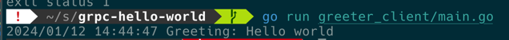
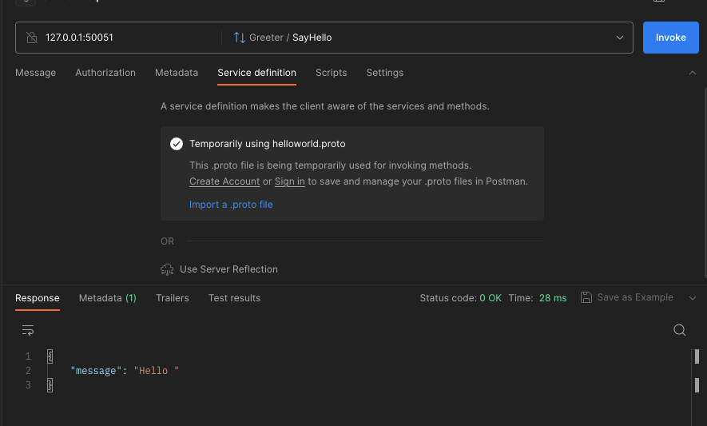

# gRPC k8s Demo
            
## 1. For gRPC server-client connection test
     
To run the gRPC server,
```shell
go run greeter_server/main.go
```

To run the gRPC client, 
open the another terminal, and
```shell
go run greeter_client/main.go
```


If you can see this response, it is succeed. 

## 2. Deploying gRPC server on the k8s cluster using Minikube

Sorry but I just skip the details for installing **minikube**.

To deploy the gRPC server on the k8s cluster, follow the steps below.

1. Turn on the docker desktop
2. `minikube start`
3. `kubectl apply -f grpc-deployment.yaml`
4. `kubectl apply -f grpc-service.yaml`
5. `kubectl apply -f grpc-ingress.yaml`
6. `minikube addons enable ingress`

Then you can check the pods are running with the command `kubectl get pods -o wide` command. 

To see the dashboard, activate the dashboard plugin with `minikube addons enable dashboard`, 
then type `minikube dashboard` to launch the dashboard.

## 3. Deploying with Helm
- Assuming that you already have `homebrew` package manager. 
- You can easily install `helm` with simple shell command 
```shell
brew install helm
```

Then you can deploy the gRPC server on the k8s cluster with following simple command.
```shell
helm install ${release name} ./grpc-demo-helm

## example
helm install grpc-demo-release ./grpc-demo-helm
```

- Check if the helm is deployed
```shell
helm ls
```

- Helm upgrade
```shell
helm upgrade ${new-release-name} ./grpc-demo-helm
```

- Helm Delete
```shell
helm uninstall ${release name}
```

## Test the gRPC connection
After 30~60 sec you apply the ingress, you can see the ingress ip address with `kubectl get ingress` command. 
But you can send the gRPC request with `127.0.0.1` local ip address.

1. Postman

Open the postman desktop application, import the proto file in the `helloworld` directory. 

2. client
You can also send the request with `greeter_client/main.go` client. 
```shell
go run greeter_client/main.go
```
